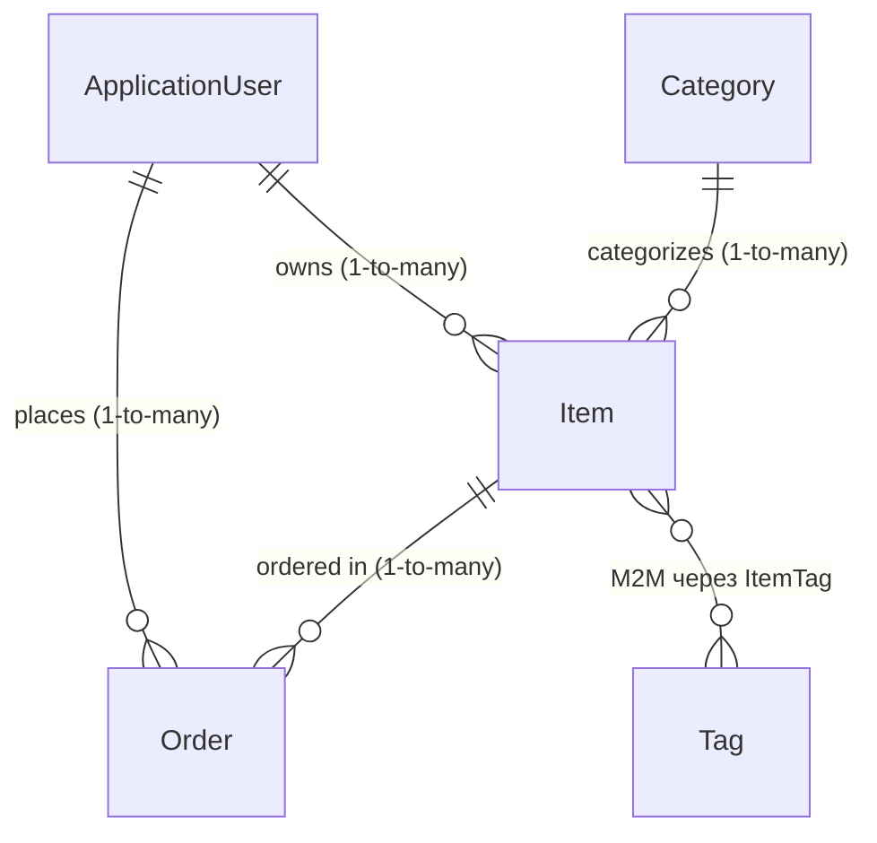

# Универсальный шаблон госэкзаменационного веб-приложения

ASP.NET Core MVC 8 + EF Core + PostgreSQL + Identity + Bootstrap 5.

> Эта ветка (`net8`) таргетится на **.NET 8 (LTS до ноября 2026)** для максимальной совместимости с университетскими компьютерами. Ветка `main` таргетит .NET 10. Если на машине стоит SDK ≥ 8 — эта ветка соберётся без проблем (.NET 8/9/10/11 — все подходят).

## Описание варианта

Реализован универсальный шаблон каталога объектов с заказами. Предметная область намеренно сделана обобщённой, чтобы один и тот же код легко переделывался под любую тему (товары, книги, фильмы, события, объявления и т.п.). Главная сущность — `Item`, к ней привязаны категория, теги и заказы от других пользователей.

**Архитектура:** MVC (модель-представление-контроллер), серверный рендеринг Razor, серверная фильтрация через GET-параметры, авто-сабмит формы фильтра на клиенте (debounce 350 мс).

**Доменная модель — 5 сущностей + связующая:**



- `ApplicationUser` — наследник `IdentityUser` (Identity).
- `Item` — главная сущность (Title, Description, Price, ImageUrl, CreatedAt, OwnerId, CategoryId, Tags).
- `Category`, `Tag`, `Order`, `ItemTag` — справочники, связи и заказы.

Полный CRUD для `Item`, `Category`, `Tag`, `Order`. Связующая `ItemTag` обновляется автоматически (частичный CRUD: создание/удаление при сохранении `Item`).

## Что предоставляется на проверку

| Артефакт | Расположение | Описание |
|---|---|---|
| Исходный код | `src/GosExamTemplate/` | Solution + один проект ASP.NET Core MVC |
| Инструкция по запуску | этот README, раздел «Запуск» | Команды, порты, env, способы инициализации БД |
| Тестовые данные (полный дамп БД) | `db/dump.sql` | `pg_dump` с DDL + INSERT'ами: 3 пользователя, 5 категорий, 6 тегов, 8 записей, 3 заказа, связи M2M |
| Схема БД (idempotent SQL) | `db/schema.sql` | Сгенерировано `dotnet ef migrations script --idempotent`, безопасно применять повторно |
| Миграции EF Core | `src/GosExamTemplate/Data/Migrations/` | Init-миграция, применяется автоматически при старте приложения |
| Авто-сидер | `src/GosExamTemplate/Data/DbSeeder.cs` | Заполняет пустую БД на старте, если в `Items` ничего нет |

## Реализованные страницы с фильтрацией и поиском

Обе страницы выполняют фильтрацию на стороне сервера через query-параметры. Запрос обновляется без полной перезагрузки кода (клиентский JS делает авто-submit формы с дебаунсом). Для MVC по требованиям перезагрузка страницы при применении фильтра допустима.

**Пагинация:** на страницах со списками (`/`, `/Items/My`, `/Orders`, `/Categories`, `/Tags`) — параметры `Page` и `PageSize` (по умолчанию 6). Сервер: `CountAsync` + `Skip`/`Take`. UI: partial `Views/Shared/_Pagination.cshtml`. При смене фильтра страница сбрасывается на 1 (`site.js`).

### Страница A: «Мои записи» (требует логина) — `/Items/My`

Список объектов, принадлежащих текущему пользователю.

| Фильтр | Параметр | Поле в БД | Тип |
|---|---|---|---|
| Поиск | `Search` | `Item.Title` ИЛИ `Item.Description` (case-insensitive `LIKE %...%`) | string |
| Категория | `CategoryId` | `Item.CategoryId` | int |
| Дата от | `DateFrom` | `Item.CreatedAt >=` | DateTime (UTC) |
| Дата до | `DateTo` | `Item.CreatedAt <=` | DateTime (UTC) |
| Цена от | `PriceFrom` | `Item.Price >=` | decimal |
| Цена до | `PriceTo` | `Item.Price <=` | decimal |

Реализация: `ItemsController.My` → `ItemService.GetMyItemsAsync`.

### Страница B: «Каталог» (публичная) — `/`

Публичный список всех объектов всех пользователей.

| Фильтр | Параметр | Поле в БД | Тип |
|---|---|---|---|
| Поиск | `Search` | `Item.Title` (case-insensitive `LIKE %...%`) | string |
| Автор (частичное совпадение) | `Owner` | `Owner.DisplayName` ИЛИ `Owner.UserName` (case-insensitive `LIKE %...%`) | string + `<datalist>` для выбора из списка |
| Тег | `TagId` | EXISTS в `ItemTag` | int |
| Цена от | `PriceFrom` | `Item.Price >=` | decimal |
| Цена до | `PriceTo` | `Item.Price <=` | decimal |

Реализация: `HomeController.Index` → `ItemService.GetPublicItemsAsync`.

### Прочие страницы

| URL | Контроллер | Описание | Доступ |
|---|---|---|---|
| `/` | HomeController.Index | Каталог (страница B) | Публичная |
| `/Identity/Account/Register` | Identity UI | Регистрация | Публичная |
| `/Identity/Account/Login` | Identity UI | Вход | Публичная |
| `/Identity/Account/Logout` | Identity UI | Выход | Аутентифицированный |
| `/Items/My` | ItemsController.My | Мои записи (страница A) | Аутентифицированный |
| `/Items/Details/{id}` | ItemsController.Details | Детали записи + список заказов | Публичная |
| `/Items/Create`, `/Items/Edit/{id}`, `/Items/Delete/{id}` | ItemsController | CRUD записи | Аутентифицированный + проверка ownership |
| `/Categories`, `/Categories/Create`, `/Categories/Edit/{id}`, `/Categories/Delete/{id}` | CategoriesController | CRUD категорий | Аутентифицированный |
| `/Tags`, `/Tags/Create`, `/Tags/Edit/{id}`, `/Tags/Delete/{id}` | TagsController | CRUD тегов | Аутентифицированный |
| `/Orders`, `/Orders/Create`, `/Orders/Edit/{id}`, `/Orders/Delete/{id}` | OrdersController | CRUD заказов (мои) | Аутентифицированный |
| `/Home/Privacy`, `/Home/Error` | HomeController | Служебные | Публичные |

## Запуск

### Требования

| Компонент | Версия | Зачем |
|---|---|---|
| .NET SDK | 8.0+ (LTS) — подходит 8, 9, 10 | Сборка и запуск приложения |
| PostgreSQL | 14+ (тестировалось на 18) | Хранилище |
| Node.js | 20+ | Только для ESLint (на запуск приложения не влияет) |

Проверить версию SDK: `dotnet --list-sdks`. Если есть строка `8.0.*` или новее — всё ок.

### Параметры подключения по умолчанию

Все настройки в `src/GosExamTemplate/appsettings.json`:

```json
{
  "ConnectionStrings": {
    "DefaultConnection": "Host=localhost;Port=5432;Database=gosexam;Username=postgres;Password=postgres"
  }
}
```

| Параметр | Значение | Как поменять |
|---|---|---|
| Host БД | `localhost` | строка `ConnectionStrings:DefaultConnection` |
| Порт БД | `5432` | там же |
| Имя БД | `gosexam` (создаётся автоматически при первом старте) | там же |
| Пользователь | `postgres` | там же |
| Пароль | `postgres` | там же |
| Порт приложения (HTTP) | `5180` | `src/GosExamTemplate/Properties/launchSettings.json`, профиль `http` |
| Порт приложения (HTTPS) | `7246` | там же, профиль `https` (нужен dev-сертификат) |

### Переменные окружения

Приложение работает без обязательных переменных окружения. Опционально:

| Переменная | Значение | Эффект |
|---|---|---|
| `ASPNETCORE_ENVIRONMENT` | `Development` (по умолчанию через `launchSettings.json`) | Включает подробные ошибки, отключает HTTPS-редирект, включает `UseMigrationsEndPoint` |
| `ASPNETCORE_URLS` | `http://localhost:5180` | Переопределяет порт без правки `launchSettings.json` |
| `ConnectionStrings__DefaultConnection` | строка подключения | Переопределяет PostgreSQL connection string без правки `appsettings.json` |

### Способы инициализации БД (выберите один)

#### Способ A (рекомендуется для проверки) — автоматически

При первом запуске приложение само:

1. Создаёт БД `gosexam`, если её нет, через `Database.Migrate()`.
2. Применяет EF Core миграции из `src/GosExamTemplate/Data/Migrations`.
3. Запускает `DbSeeder.SeedAsync`, который добавляет 3 пользователей, 5 категорий, 6 тегов, 8 записей и 3 заказа, если таблица `Items` пуста.

Ничего вручную делать не нужно — просто `dotnet run`.

#### Способ B — восстановить из готового дампа `db/dump.sql`

Готовый дамп с тестовыми данными можно применить через `psql`. Понадобится, если хочется иметь идентичный набор данных без запуска приложения сначала:

```powershell
# 1. Создать пустую БД
psql -h localhost -p 5432 -U postgres -c "CREATE DATABASE gosexam;"

# 2. Восстановить дамп
psql -h localhost -p 5432 -U postgres -d gosexam -f db/dump.sql
```

Дамп содержит как структуру (DDL), так и данные (INSERT). После восстановления `dotnet run` сразу подцепит существующую БД, новые миграции применяться не будут (так как `__EFMigrationsHistory` тоже из дампа).

#### Способ C — только схема (идемпотентно), данные потом наполнит сидер

```powershell
psql -h localhost -p 5432 -U postgres -c "CREATE DATABASE gosexam;"
psql -h localhost -p 5432 -U postgres -d gosexam -f db/schema.sql
dotnet run --project src/GosExamTemplate --launch-profile http
# приложение увидит пустую таблицу Items и запустит DbSeeder
```

### Если на экзаменационном компе другой .NET

Сначала проверьте, что вообще установлено:

```powershell
dotnet --list-sdks       # покажет все SDK
dotnet --list-runtimes   # покажет все рантаймы
```

| Что показывает `--list-sdks` | Что делать |
|---|---|
| `8.0.*`, `9.0.*` или `10.0.*` (или любая комбинация) | Использовать эту ветку (`net8`). Сборка пойдёт на любом SDK ≥ 8. |
| Только `6.0.*` или `7.0.*` (давно EoL) | Поставить .NET 8 SDK: `winget install Microsoft.DotNet.SDK.8` или скачать с https://dot.net/download. |
| Пусто (нет ни одного SDK) | Поставить .NET 8 SDK тем же способом. Запросить у админа права при необходимости. |

Минимальный план «достать .NET 8 без админ-прав»: на странице https://dot.net/download скачать ZIP-архив SDK для Windows x64, распаковать в `C:\Users\<вы>\dotnet`, добавить эту папку в `PATH` для текущей сессии:

```powershell
$env:PATH = "C:\Users\$env:USERNAME\dotnet;$env:PATH"
dotnet --list-sdks   # должно появиться 8.0.x
```

### Команды запуска (Способ A)

```powershell
# 1. Восстановить локальные .NET-инструменты (EF Core CLI 8.0)
dotnet tool restore

# 2. Сборка
dotnet build src/GosExamTemplate

# 3. (Опционально) Установка JS-зависимостей для ESLint
cd src/GosExamTemplate
npm install
cd ../..

# 4. Запуск
dotnet run --project src/GosExamTemplate --launch-profile http
```

Откройте `http://localhost:5180`. На первом запуске миграция и сидер занимают 2–5 секунд.

> Шаг 1 (`dotnet tool restore`) нужен только если планируете работать с миграциями (`dotnet ef migrations add`). Для обычного запуска приложения он необязателен — миграции применяются на старте автоматически.

### Тестовые учётные данные (после применения сидера или дампа)

| Email | Пароль | Кто такой |
|---|---|---|
| `alice@example.com` | `Passw0rd!` | Алиса — владелец 3 объектов |
| `bob@example.com` | `Passw0rd!` | Боб — владелец 3 объектов |
| `carol@example.com` | `Passw0rd!` | Кэрол — владелец 2 объектов |

### Проверка чистоты

```powershell
cd src/GosExamTemplate

# 1. Сборка без warnings
dotnet build      # ожидается: 0 warnings, 0 errors

# 2. ESLint без warnings
npm run lint      # ожидается: пустой вывод (нет нарушений)

# 3. В консоли браузера (F12) и логе сервера — ноль ошибок
```

## Стек и архитектура

| Слой | Технология | Где код |
|---|---|---|
| Runtime | .NET 8 (LTS до ноября 2026) | — |
| Веб-фреймворк | ASP.NET Core MVC 8 | `Controllers/*` |
| ORM | EF Core 8 | `Data/ApplicationDbContext.cs` |
| База данных | PostgreSQL через `Npgsql.EntityFrameworkCore.PostgreSQL` | конфиг в `appsettings.json` |
| Аутентификация | ASP.NET Core Identity с кастомным `ApplicationUser` | `Models/Entities/ApplicationUser.cs` + `Program.cs` |
| Авторизация | Глобальный `AuthorizeFilter` + `[AllowAnonymous]` на публичных | `Program.cs` (фильтр), `HomeController` (`[AllowAnonymous]`) |
| Слой бизнес-логики | Сервисы | `Services/I*Service.cs` + `*Service.cs` |
| DTO | Form, List, Details, Filter | `Dtos/*` |
| UI | Bootstrap 5, Razor Views | `Views/*` + `wwwroot/css/site.css` |
| Клиентская валидация | jQuery Validation Unobtrusive | `Views/Shared/_ValidationScriptsPartial.cshtml` |
| Серверная валидация | DataAnnotations + `ModelState.IsValid` | DTO + контроллеры |
| Линтер JS | ESLint 9 (flat config) | `eslint.config.js`, `package.json` |

### Принципы

- **Контроллеры тонкие.** Только I/O и `ModelState`. Бизнес-логика и LINQ — только в `Services/*`.
- **Сущности не уходят во View.** Везде DTO.
- **Авторизация по умолчанию.** Глобальный фильтр `[Authorize]`, на публичных эндпоинтах `[AllowAnonymous]`.
- **Ownership.** В `ItemsController.Edit/Delete` и `OrdersController.Edit/Delete` сервис проверяет `OwnerId == currentUserId` — чужие записи нельзя править или удалить.
- **TreatWarningsAsErrors + Nullable** включены в `.csproj`.
- **DTO для всего.** Никаких `dynamic`, никаких сущностей EF в Razor.

## Как переделать шаблон под предметную область за 30–40 минут

Допустим, на экзамене вы вытянули билет «Библиотека книг». Главная сущность `Item` становится `Book`, а `Order` становится `Borrow`. Действуйте по чек-листу.

### Шаг 1. Find & Replace в Visual Studio (Ctrl+Shift+H)

Используйте «Match case» + «Match whole word»:

| С | На (пример «Библиотека») |
|---|---|
| `Item` | `Book` |
| `Items` | `Books` |
| `Order` | `Borrow` |
| `Orders` | `Borrows` |

### Шаг 2. Подгоните свойства

Откройте `Models/Entities/Book.cs` (бывший `Item.cs`) и переименуйте поля при необходимости:

- `Title` → `Name`/`Author`/…
- `Description` → `Annotation`/…
- `Price` → можно оставить или переименовать в любое числовое поле (рейтинг, год).
- `CreatedAt` → дата публикации/события.

Аналогично — в DTO и в `[Display(Name = "...")]`.

### Шаг 3. Пересоздайте БД и миграции

```powershell
cd src/GosExamTemplate
Remove-Item -Recurse Data/Migrations
dotnet ef database drop -f
dotnet ef migrations add Init --output-dir Data/Migrations
dotnet run
```

### Шаг 4. Обновите сидер

`Data/DbSeeder.cs` — поменяйте `Categories`, `Tags`, `Items` под домен. Минимум: 5 категорий, 6 тегов, 8 объектов, 3 заказа.

### Шаг 5. Подпишите UI

- `Views/Shared/_Layout.cshtml` — заголовок шапки и пункты меню.
- `Views/Home/Index.cshtml` — заголовок страницы B.
- `Views/Books/*.cshtml` — заголовки `<h1>` (после переименования папки).

CRUD, фильтры, валидация, авторизация, тосты, адаптивка — переделывать не нужно, они домен-агностичные.

## Структура проекта

```
GosExamTemplate.sln
├── README.md                         ← этот файл
├── Требования.md                     ← оригинальный текст задания
├── .gitignore
├── db/
│   ├── dump.sql                      ← pg_dump (DDL + данные) — для способа B
│   └── schema.sql                    ← EF migrations script --idempotent — для способа C
└── src/GosExamTemplate/
    ├── Controllers/                  Home, Items, Categories, Tags, Orders
    ├── Data/
    │   ├── ApplicationDbContext.cs
    │   ├── DbSeeder.cs
    │   └── Migrations/               Init-миграция EF Core
    ├── Dtos/
    │   ├── Items/                    Form, List, Details, MyItemsFilter, PublicItemsFilter
    │   ├── Categories/CategoryDto.cs
    │   ├── Tags/TagDto.cs
    │   └── Orders/                   OrderFormDto, OrderListDto
    ├── Models/
    │   ├── Entities/                 ApplicationUser, Item, Category, Tag, ItemTag, Order
    │   └── ErrorViewModel.cs
    ├── Services/
    │   ├── IItemService.cs + ItemService.cs
    │   ├── ICategoryService.cs + CategoryService.cs
    │   ├── ITagService.cs + TagService.cs
    │   └── IOrderService.cs + OrderService.cs
    ├── Views/
    │   ├── Shared/                   _Layout, _LoginPartial, _Toasts, _ValidationScriptsPartial, Error
    │   ├── Home/                     Index (= страница B), Privacy
    │   ├── Items/                    My (= страница A), Form, Details, Delete, _ItemCard
    │   ├── Categories/, Tags/, Orders/
    │   └── _ViewImports.cshtml, _ViewStart.cshtml
    ├── Areas/Identity/               Login/Register/Logout (используют ApplicationUser)
    ├── wwwroot/
    │   ├── css/site.css
    │   ├── js/site.js                тосты, спиннер на submit, авто-сабмит фильтров
    │   └── lib/                      Bootstrap, jQuery, validation (LibMan)
    ├── Properties/launchSettings.json
    ├── appsettings.json              ConnectionStrings:DefaultConnection
    ├── appsettings.Development.json
    ├── Program.cs
    ├── GosExamTemplate.csproj        TreatWarningsAsErrors + Nullable
    ├── package.json                  devDependencies: eslint
    └── eslint.config.js              flat config (ESLint 9)
```

## Сопоставление с критериями оценки

| Критерий                                                       | Где реализовано                                                            |
|----------------------------------------------------------------|----------------------------------------------------------------------------|
| (3) ≥4 сущности, 1-to-many, M2M                                | `Models/Entities/*` + `Data/ApplicationDbContext.OnModelCreating`          |
| (3) Архитектура MVC                                            | ASP.NET Core MVC, Razor Views                                              |
| (3) ≥3 функционально различные страницы                        | `/`, `/Items/My`, `/Items/Details`, `/Items/Create`, `/Categories`, …       |
| (3) CRUD ≥2 сущностей                                          | Полный CRUD для `Item`, `Category`, `Tag`, `Order`                         |
| (3) JS/TS + система сборки + адаптив                           | `wwwroot/js/site.js`, `dotnet build`, Bootstrap grid                       |
| (3) Хранение данных + валидация                                | PostgreSQL + EF Core, `DataAnnotations` + `ModelState`                     |
| (4) Бизнес-логика в сервисах                                   | `Services/*`                                                               |
| (4) DTO                                                        | `Dtos/*`                                                                   |
| (4) Валидация client + server                                  | `jquery.validate.unobtrusive` + `ModelState.IsValid`                       |
| (4) Разделение dev/runtime зависимостей                        | `.csproj` — runtime; `package.json` `devDependencies` — линтер             |
| (4) Тестовые данные (3+ user, 5–10 объектов)                   | `Data/DbSeeder.cs` + `db/dump.sql`                                         |
| (4) Адаптивная вёрстка                                         | Bootstrap 5, `col-12 col-sm-6 col-lg-4 col-xxl-3`                          |
| (4) CRUD для всех основных сущностей                           | `Item`, `Category`, `Tag`, `Order`                                         |
| (5) Без warning'ов при сборке/запуске                          | `TreatWarningsAsErrors`, `npm run lint` чисто, лог dotnet чисто            |
| (5) Две страницы с фильтрацией по спецификации                 | `/Items/My` и `/`                                                          |
| (5) Полноценная auth/authz                                     | Identity + глобальный `[Authorize]` + проверка ownership                   |

## Полезные команды

```powershell
# Полный rebuild
dotnet clean; dotnet build

# Запуск
dotnet run --project src/GosExamTemplate --launch-profile http

# Создать новую миграцию (после изменения моделей)
cd src/GosExamTemplate
dotnet ef migrations add НазваниеМиграции --output-dir Data/Migrations

# Применить миграции (обычно не нужно — приложение применяет автоматически)
dotnet ef database update

# Сбросить БД
dotnet ef database drop -f

# Перегенерировать дамп БД (после изменения сидера)
$env:PGPASSWORD = "postgres"
& "C:\Program Files\PostgreSQL\18\bin\pg_dump.exe" -h localhost -p 5432 -U postgres -d gosexam --inserts --column-inserts -E UTF8 -f db/dump.sql

# Перегенерировать schema.sql
cd src/GosExamTemplate
dotnet ef migrations script -o ../../db/schema.sql --idempotent

# Линтер
npm run lint
```
